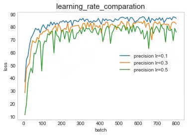

# ResNet Implementation for CIFAR10 in PyTorch

The experiment is carried out on the data set CIFAR10. The network selected in the experiment is ResNet32, and we do the hyper-parameters tuning and analyzing.

## Start to train

ResNet32, lerning_rate=0.1
```bash
python -u trainer.py --epochs=100 --lr=0.1 --weight-decay=1e-4
```
<div align="center">
  
</div>

ResNet32, lerning_rate=0.3
```bash
python -u trainer.py --epochs=100 --lr=0.3 --weight-decay=1e-4
```
<div align="center">
  
</div>

ResNet32, lerning_rate=0.5
```bash
python -u trainer.py --epochs=100 --lr=0.5 --weight-decay=1e-4
```
<div align="center">
  
</div>

## Tune the learning rate

We can compare the train loss and precision between different learning rates of the model, and we can find that when the learning rate is 0.1, the ResNet model show the better effect.

<div align="center">
  
</div>

<div align="center">
  
</div>

## Tune the weight decay

We set different weight decay and compare the train loss and precision. It can be observed that the smaller the weight decay is, the more gently the loss declines and the smaller the fluctuation of precision is.

<div align="center">
  
</div>

<div align="center">
  
</div>

## Adjust the batch size

We set three batch size which are 32, 64 and 128, to find the its influence of the model. In fact, we didn't adjust the corresponding learning rate, so that we can find the relation between learning rate and batch size. By comparation, we can see that the decline in loss is basically the same. Without tuning the learning rate, the results of the model with 128 of batch size are relatively better, which shows that it is necessary to tune learning rate whlie adjusting the batch size.

<div align="center">
  
</div>

<div align="center">
  
</div>
