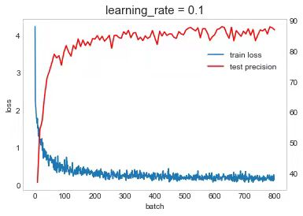

# ResNet Implementation for CIFAR10 in PyTorch

The experiment is carried out on the data set CIFAR10. The network selected in the experiment is ResNet32, and we do the hyper-parameters tuning and analyzing.

## Start to train

ResNet32, lerning_rate=1

```bash
python -u trainer.py --epochs=100 --lr=0.1 --weight-decay=1e-5
```

<div align="center">
  
</div>
